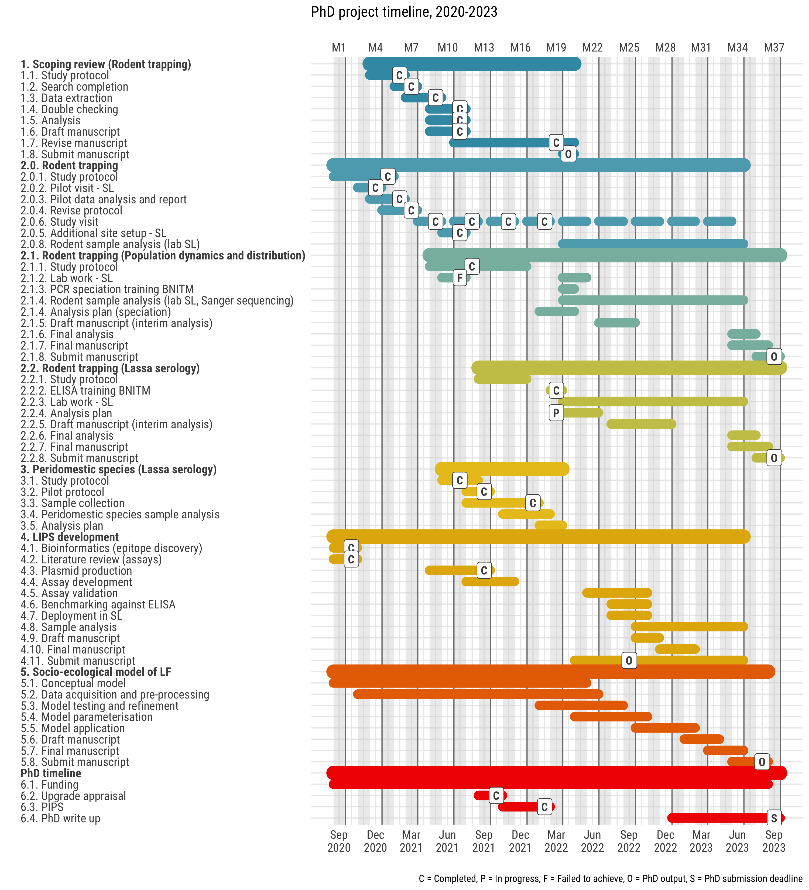

```{r setup-1, include=FALSE}
knitr::opts_chunk$set(echo = FALSE, warning = FALSE)

```

# Appraisal report

## Introduction

The strong link between human health and the environment is particularly evidence in the context of infectious diseases [@whitmee_safeguarding_2015; @sandifer_exploring_2015].  Significant reductions in morbidity and mortality associated with infectious diseases have been achieved following improvements in hygiene, sanitation and the use of antimicrobials [@aiello_what_2002]. However, in 2019, 13.9% of annual deaths and 16.6% of disability adjusted life years lost globally were directly attributable to infectious diseases [@vos_global_2020]. Up to 58% of these infectious diseases are considered zoonotic, either through direct transmission from zoonotic sources (e.g. Ebola virus disease, Lassa fever, Nipah virus) or emerging from a zoonotic origin (e.g. HIV, multiple influenza strains, SARS-CoV and MERS-CoV) [@woolhouse_host_2005; @de_wit_sars_2016]. Global pandemics such as the ongoing HIV and SARS-CoV-2 outbreaks demonstrate the potential impact of zoonotic diseases on human mental and physical health in a highly connected world [@tatem_global_2006; @bogoch_pneumonia_2020].

### Drivers of zoonotic disease emergence

The emergence of a novel zoonotic disease from animal hosts into human populations (i.e. spillover events) can usefully be conceptualised as a complex system [@wood_framework_2012; @redding_impacts_2019]. In such a complex system, multiple, interconnected components - e.g., the physical environment, the zoonotic host niche, the human populations - interact to modify the risk of zoonotic disease spillover (Figure 1.). First, with regards to the physical environment, changes such as anthropogenic climate change leading to increased temperature and altered precipitation can modify habitat suitability for animals [@garcia-pena_land-use_2021] (Figure 1. A). In addition, such changes can allow pathogens to viably persist in the environment for prolonged periods. For example, increased precipitation in Fiji has been associated with increased number of human cases of leptospirosis and an increased risk of infection [@lau_human_2016]. Second, with regards to reservoir populations, land use modification including deforestation and subsequent conversion to agricultural or urban habitats (Figure 1. B) can lead to their increased abundance [@jones_zoonosis_2013] and the displacement of non-reservoir hosts with which they compete [@gibb_zoonotic_2020]. These alterations to species' assemblages can lead to a reduction in the "dilution effect", defined as -  increasing species diversity (species richness plus evenness) within the host community reducing zoonotic disease risk as measured by infection prevalence [@ostfeld_biodiversity_2000]. Reduced infection prevalence is typically observed in species rich ecosystems [@civitello_biodiversity_2015], with reduced biodiversity increasing the prevalence of zoonotic pathogens within host species [@bordes_transmission_2015] (Figure 1. C). Third, translocation of species into new environments has resulted in range expansion of human commensal species [@tompkins_emerging_2015] that may transport pathogens into novel regions [@morand_global_2015; @guth_ecological_2020] or become novel hosts for zoonoses [@daszak_emerging_2000]. Further, introduction of domesticated livestock and agricultural intensification is an important driver of zoonotic risk, firstly, through food-borne zoonoses (e.g., *E. coli*) and secondly as novel pathogen host populations (e.g., *Nipah virus* and domesticated pig populations) [@karesh_ecology_2012]. Fourth, global changes in human populations will lead to higher population density [@roser_future_2013] and in some zoonotic disease systems, increased contact with reservoir species [@hassell_urbanization_2017]. Higher human population density and wildlife contact rates would increase density-dependent transmission of infectious diseases which may result in increased probability of zoonotic disease spillover events [@begon_transmission_1999; @wang_mammal_2021] (Figure 1. E). Future responses to physical environment change may also lead to large scale migration of human populations from non-endemic to endemic regions, this could increase the risk pathogen spillover further in certain regions [@cattaneo_human_2019]. Fifth, drivers within these human societies such as access to healthcare [@cascio_socio-ecology_2011; @walsh_whence_2020] and food security [@brooks_emerging_2021] (Figure 1. H) moderate the risk of zoonotic disease spillover in non-linear ways (e.g. the banning of wild animal markets may drive these activities away from comprehensive monitoring systems [@roe_beyond_2020]). This highlights the complexity of the dynamic risk of zoonotic disease spillover (Figure 1. D). In addition, as is characteristic of complex systems, spillover events are not homogeneous across space and time, with specific regions and human populations proposed to be at risk of emerging or endemic zoonotic infectious diseases [@suzan_metacommunity_2015; @allen_global_2017].

![Conceptual map of zoonotic infectious disease emergence and spillover risk. Letters **A**-**G** are key causal system components leading to pathogen spillover into human populations. **H** represents potential socioeconomic drivers of risk of spillover and maintenance of an epidemic in human populations. Bulleted lists within the systems are examples of key sub-components with arrows showing direct links within nested systems. Within the physical environment (**A**), host niches (**B**), the infected host niche (**C**) and human populations (**E**) are nested with change occurring over  prolonged time periods (i.e. years rather than days). Endemic human populations (**F**) are a nested subgroup of human populations (**E**) where populations at risk can be modified by migration or expansion of the host niche (**B**). Socio-economic drivers (**H**) affect all human populations and may also modify the physical environment (**A**), the host niche (**B**), the infected host niche (**C**) and pathogen spillover (**D**). Pathogen spillover occurs at the spatial and temporal interface of infected hosts (**C**) and human populations at risk (**F**). Infected human populations (**G**) can lead to wider transmission within endemic human populations in addition to importing infectious cases into non-endemic human populations. Systems dynamics model adapted from [@redding_impacts_2019].](appraisal_figures/system_dynamics_zoonoses.png)

### Hotspots for emerging zoonoses

The potential impact of zoonotic spillover on human health has led to significant research efforts dedicated to the production of "hotspot" maps (i.e., prediction maps) for likely spillover events. Various methodological approaches have been used, including literature reviews of previous emergence events, host-based species distribution mapping and machine learning approaches applied to data on known and predicted pathogens. First, a review of available data on emerging infectious disease events - defined as, the first temporal emergence of a pathogen in a human population which was related to the increase in distribution, increase in incidence or increase in virulence or other factor which led to that pathogen being classa as an emerging disease -  explored their geographic location accounting for bias in research effort [@jones_global_2008]. Approximately, 60% of these events were zoonotic, with Eastern Europe, Southern and South East Asia, Central and South America and West and East Africa identified as geographic regions at increased risk for infectious disease emergence from wildlife. Second, analysis of the distribution of known and predicted hosts - based on taxonomy and traits - of zoonotic infectious diseases, identified Central and South America, Central East Africa, Europe and South East Asia as containing high reservoir richness [@han_global_2016]. In addition, the two taxa were proposed to contribute to the greatest number of potential unique zoonotic pathogens were rodents (Rodentia) and bats (Chiroptera). This has been further supported by a study investigating the effect of land use change under different future scenarios, which identified West Africa as a region of increased hazard for rodent-borne diseases [@garcia-pena_land-use_2021]. Third, applying machine learning to data on zoonotic host status and host life history traits, locations and species have been identified where pathogen diversity is currently under researched [@olival_host_2017; @albery_predicting_2020]. Specifically, several of these studies have identified West Africa as a region at risk for zoonoses emergence. However, these studies were limited by not incorporating key information on healthcare infrastructure, disease surveillance processes, agricultural and livestock intensification and human population demographic change, which contribute to the risk of zoonotic spillover.

### Rodents as zoonotic hosts

As highlighted above, many studies have identified rodents as particularly important for zoonotic spillover events in West Africa. Rodents are ubiquitous, representing more than 40% of all global mammal species and are found on all continents except Antarctica. Many of these species are commensal and thrive in human dominated ecosystems [@delia_rodent_2019]. Ongoing land use change can lead to replacement of more specialised rodent species by generalists that are better able to adapt to changing conditions [@gibb_zoonotic_2020]. Generalists typically exhibit a cluster of traits - termed a "fast" life history - including high abundance, small body mass, high reproductive rate and a reliance on innate, constitutive immunity to protect against pathogens [@albery_fast-lived_2021]. In addition, rodents with traits conducive to range expansion into altered habitats are also more likely to host known zoonotic pathogens [@albery_urban-adapted_2021]. Human activity can artificially increase species' ranges through introduction into new habitats via trade- and transport networks (e.g. *Mus musculus* and *Rattus norvegicus*). Pathogens of these newly introduced species are likely also transported via the same routes (e.g. plague) [@vogler_decade_2013].

Rodents play important roles in the provision of ecosystem services and disservices [@keesing_impacts_2010; @cunningham_one_2017]. In West Africa these include services such as being seed predators, seed dispersers and controlling insect abundance [@fischer_ecosystem_2018], and disservices such as acting as pest species of agricultural crops [@makundi_ecologically-based_2011]. Biodiverse rodent species assemblages can compound these services, as individual species often occupy different niches [@fischer_ecosystem_2018]. The role that a rodent species may have in the emergence of a zoonotic pathogen can be conceptualised as an ecosystem disservice [@ostfeld_is_2017]. An estimated 244 of 2220 rodent species are hosts of at least 85 known zoonotic pathogens [@han_rodent_2015]. Rodent borne diseases are distributed globally [@meerburg_rodent-borne_2009] and are typically associated with resource poor settings, low levels of education, poor sanitation, and limited access to healthcare [@iles_socio-economic_2006]. Within resource poor countries the risk of disease is not uniform and follows a socio-economic gradient with diseases primarily affecting the poorest communities within endemic regions [@grace_business_2014; @khalil_poverty_2021].

### Lassa fever as a model disease system

In West Africa (suggested to be an at-risk region for emerging zoonoses), *Borrelia sp*, Schistomiasis and Toxoplasmosis are important rodent-borne diseases leading to significant human morbidity and mortality. Lassa fever is a particularly important and under explored rodent-borne zoonosis of humans [@meerburg_rodent-borne_2009]. Caused by the Arenaviridae *Lassa mammarenavirus*, Lassa fever is a zoonosis first identified from a case series of infected patients originating near Jos, Nigeria in 1969 [@frame_lassa_1970]. *Mastomys natalensis* was identified as the reservoir following an outbreak in Sierra Leone during 1970-72 [@monath_lassa_1974-1]. However, several other rodent species have been found to carry the virus, potentially producing a more complex pathogen transmission network [@olayemi_new_2016]. Human infection is caused by spillover of the virus from infected rodents or their excreta [@mccormick_prospective_1987]. Viral infection in humans is thought to be via the nasopharyngeal mucosa, with subsequent viral spread to the lymphatics before dissemination to virtually all tissues [@jahrling_lassa_1980]. Necrosis can occur, particularly in the liver and spleen, severe disease is caused by vascular instability and impaired haemostasis resulting in a viral haemorrhagic fever syndrome [@walker_pathologic_1982]. Human-to-human transmission is less commonly observed. When reported, it is associated with nosocomial (healthcare) transmission through direct contact with an infected person's bodily fluids and secretions, with healthcare workers at greatest risk [@fisher-hoch_review_1995]. Risk factors for Lassa fever infection include hunting rodents for food, rodents residing in human habitation and insecure food storage [@ter_meulen_hunting_1997]. Among healthcare workers, specific risks include direct patient interactions, specifically surgery, and nursing care, although adequate personal-protective equipment can reduce this risk [@holt_mixed-methods_2021]. Lassa fever is currently considered endemic in 8 West African countries: Benin, Ghana, Guinea, Liberia, Mali, Nigeria, Sierra Leone and Togo by the World Health Organisation (WHO) [@world_health_organisation_lassa_2021]. Sporadic cases  in Burkina Faso and Côte d'Ivoire have also been reported (Figure 2 A). Imported cases have been reported from non-West African countries such as the United Kingdom, Germany and the United States [@tuite_potential_2019; @wolf_fifty_2020].

#### Lassa fever epidemiology

Annual Lassa fever incidence is unknown, with estimates ranging between 150,000 [@mccormick_prospective_1987] and 4,300,000 cases per year [@basinski_bridging_2021] cases annually. The uncertainty surrounding these estimates is due to a combination of few serological studies, limited disease surveillance and an overlap between the symptomatology of Lassa fever with other infectious diseases in these endemic regions (e.g. malaria). Mortality (case-fatality rate) is reported as 29.7% [@kenmoe_systematic_2020], although this varies by country and year. These mortality estimates are likely biased due to widespread under-reporting of pauci- or asymptomatic cases which make up at least 80% of infections [@world_health_organisation_lassa_2021]. Morbidity is poorly understood; however, significant long term sensori-neural hearing loss is the most important sequelae in survivors of acute infection [@ficenec_review_2019]. However, the incidence and severity of this has not been comprehensively studied [@ficenec_lassa_2020], hence illustrating the need for further research into this rodent-borne disease.

![**A** Confirmed Lassa fever cases in West African countries since 2011. The grey shaded area represents the Ebola epidemic that lasted from December 2013 until June 2016. The orange shaded area represents incomplete case data from the current year. Annual confirmed and reported cases are shown for the countries considered endemic for Lassa fever. Ghana and Mali have only reported confirmed cases for a single year. Guinea and Togo reported cases for several of the years reviewed. Benin, Liberia, Nigeria and Sierra Leone reported cases during all or most years, however, case counts were much larger in Nigeria than elsewhere. Single cases have been reported for two non-endemic countries, Côte d'Ivoire and Burkina Faso. **B** Map of West Africa with the distribution of *Mastomys natalensis* (red shaded region) the primary reservoir host of *Lassa mammarenavirus* highlighted. All countries of the West African region are labelled with countries shaded by the status of Lassa fever in the country reported by the WHO.](appraisal_figures/lassa_cases_mastomys_range.png)

Due to the paucity of data, Lassa fever has been designated as a WHO priority disease for research and development to drive improvements in epidemiological understanding and clinical treatment. To date, the most comprehensive epidemiological data has been generated by the Nigerian Centres for Disease Control, with seasonal dynamics of outbreaks reported following the implementation of a mandatory notification processes and the creation of national reference laboratories for Lassa fever in several Nigerian states [@agbonlahor_52_2021]. Since, 2017, weekly situation reports have been published (Figure 2. A). In Sierra Leone a partnership established between the US Centres for Disease Control and the Ministry of Health and Sanitation in 1976 led to the creation of a dedicated Lassa fever ward at Kenema General Hospital in the endemic Eastern Province, with testing of suspected and confirmed cases recorded since 2008 [@shaffer_lassa_2014]. In Guinea, few cases have been reported since a study in 1999 [@bausch_lassa_2001], with seven cases reported since 2011. Data from Liberia is limited with cases intermittently recorded in WHO situation reports [@world_health_organisation_emergency_2021]. Benin, Ghana, Mali, and Togo do not make any data available on incident cases. However, cases from these countries have been recorded in academic journal articles and shared through the ProMED network [@promed_promed_2021]. A regional sero-epidemiological survey funded by the Coalition for Epidemic Preparedness Innovation (CEPI) has recently been implemented in Nigeria, Sierra Leone, Liberia and Guinea in preparation for phase 2 vaccine studies [@coalition_for_epidemic_preparedness_innovations_lassa_2020]. Despite this increased focus on human epidemiology, few studies on the primary rodent hosts in this geographic region have been conducted.

#### Zoonotic hosts of *Lassa mammarenavirus*

The primary host of *Lassa mammarenavirus* has been identified as the multimammate rat (*Mastomys natalensis*) a rodent species that is found across much of sub-Saharan Africa, however, outside of West Africa no individual rodents have been found to be infected with *Lassa mammarenavirus*. Other rodent species including *Hylomyscus pamfi* and *Mastomys erythroleucus* have been found to be acutely infected (through Polymerase Chain Reaction based assays) or have evidence of prior exposure to the virus (through serological assays) [@olayemi_new_2016]. Some evidence exists for prior exposure to *Lassa mammarenavirus* in non-rodent species, including domestic dogs, non-human primates and shrews [@kenmoe_systematic_2020]. However, comprehensive studies in diverse Lassa fever endemic regions have not been performed and the role these species may have in  *Lassa mammarenavirus* transmission dynamics is unclear. Most studies to date have focussed on the known host with fewer studies investigating wider rodent assemblages in endemic regions [@fichet-calvet_risk_2009].Research examining rodent assemblages is therefore urgently needed, as the interaction of different within an ecosystem can modify pathogen spillover risk (as outlined in the conceptual map in Figure 1.).

Dynamic models of Lassa fever spillover risk have been produced to investigate seasonal dynamics of infection in Nigeria [@akhmetzhanov_quantifying_2019 ;@musa_mechanistic_2020]. These mechanistic models incorporate *Mastomys natalensis* populations, however, they are limited by sparse data to parameterise rodent populations and viral transmission dynamics within the hosts. Further, these models do not utilise a model structure that reflects the host species existing within wider rodent assemblages that moderate pathogen spillover risk. Similar limitations exist for a stochastic individual based model developed to explore the effect of rodent control on Lassa fever spillover risk in Guinea [@marien_evaluation_2019]. A dynamic model derived from the conceptual map (Figure 1.) will incorporate important factors that are missing from these earlier models. 

The number of reported cases of Lassa fever is increasing (Figure 2. B), likely due to increased surveillance. However, growing human populations at risk and land use change in the endemic region likely also contribute to increased cases [@agbonlahor_52_2021]. The disentangling of the factors that drive increased cases is vital for understanding the potential future risk of Lassa fever in the endemic region and beyond. Therefore, comprehensive baseline data of human cases and viral transmission among rodent assemblages, in addition to dynamic modelling of the disease system, are required. This would also help understand factors driving novel disease spillover from rodent populations under changing environmental conditions.

## Thesis outline

### Thesis aims and questions

In this thesis, I aim to explore the effect of the composition of rodent assemblages and the environment they reside within on the risk of Lassa fever spillover in Sierra Leone, West Africa. First, I will trap rodents in a Lassa fever endemic region Sierra Leone. Second, I will use the data to paramaterise a dynamic model of *Lassa mammarenavirus* transmission. I expect my thesis to contribute to a greater understanding of the ecological conditions supporting viral transmission in dynamic populations of rodents and humans, with the dynamic model used as a framework for other host-pathogen systems in similar contexts. Below, I outline the planned chapters of this thesis and the questions I seek to address.

### Chapter 1: General introduction

### Chapter 2: A scoping review of rodent trapping studies to understand the prevalence of zoonotic disease in West Africa.

This chapter includes a scoping review of rodent trapping studies in West Africa to synthesise current evidence for the presence and absence of potential zoonotic infectious diseases in rodents and small mammals. I proceed to investigate the effect of sampling bias and spatial heterogeneity on the identification of regions at potential risk of zoonotic infectious disease emergence. Using this framework I ask whether the current evidence shapes our understanding of risk and I will identify locations and host-pathogen systems in need of further targeted research. 

I aim to address the following questions:   

  1. What information do rodent trapping studies provide to inform zoonotic spillover risk maps and what disease systems require further researcg?
  2. To what extent does sampling bias influence the prediction of spillover risk?
  3. Which diseases endemic to West Africa have been investigated using rodent trapping?

#### Abstract

Rodents are important reservoirs of zoonotic infectious diseases; 255 species are known hosts of 85 zoonotic pathogens. These reservoir species are globally distributed with West Africa containing multiple known and several further predicted reservoir species. Typically, International Union for Conservation of Nature (IUCN) species distribution maps and Global Biodiversity Information Facility (GBIF) presence maps are used to determine regions at risk for zoonotic spillover events, however, these datasets are biased by incomplete sampling. To investigate the impact of rodent species sampling heterogeneity on zoonotic spillover risk we have systematically reviewed rodent trapping studies to produce a contextually rich dataset that can be used to explore this risk at finer spatial resolution. Here we show that sampling of rodents and their pathogens in the West African region are spatially biased by country and trapping habitat. We found that rodent trapping effort was associated with regional population density and was increased in habitats modified by human activity. We produce updated rodent species ranges compared to available IUCN maps and enrich GBIF data by including locations of rodent species absence and trapping effort. Furthermore, we report the spatial bias in the investigation of four important rodent zoonoses, Arenaviridae, *Borellia sp.*, *Bartonella sp.* and *Toxoplasma sp.*. Our results highlight that incorporating sampling bias is important when assessing the risk for zoonotic spillover events from rodents. The synthesis of contextually rich rodent trapping data contributes important information that is lacking in IUCN distribution maps and GBIF species presence data. We anticipate this dataset can support the production of more complete spatial risk assessments of zoonotic spillover events. For example, the inclusion of absence data and trapping effort can help identify regions where data sparsity may produce inappropriately predicted risk. Furthermore, this data specifies regions in need of comprehensive study for four targeted rodent zoonoses, Arenaviridae, *Borellia sp.*, *Bartonella sp.* and *Toxoplasma sp.*.

#### Current progress

A draft manuscript has been produced and is attached as appendix 1. A web based application has also been produced to provide curated data for re-use and to support further exploration of this dataset, the app is available [here](https://diddrog11.shinyapps.io/scoping_review_app/).

### Chapter 3: Rodent trapping to explore rodent assemblage structure in Eastern Sierra Leone.

In this chapter I report a longitudinal rodent trapping study at four study sites in a Lassa fever endemic region of Eastern Sierra Leone. I perform rodent trapping along socio-ecological gradients to understand the association of land use on rodent species assemblages and population structures. I will perform morphological and molecular speciation on sampled rodents to understand the spatial and temporal dynamics of rodent species at the selected study sites. Data obtained from this study will be used to inform species occupancy and distribution models in the Eastern province of Sierra Leone. These models can be used to identify regions of interest for further investigation of Lassa fever epidemiology.

I aim to address the following questions:   

  1. What rodent species are prevalent at the study sites and how are species assemblages structured?
  2. How do these species assemblages vary over time and space and are population structures associated with land use?
  3. What is the potential impact of climate and land use change on *Lassa mammarenavirus* spillover risk?
  
#### Abstract

Lassa fever is endemic to Eastern Sierra Leone. The principal reservoir species, *Mastomys natalensis*, is considered abundant in human dominated habitats, although these rodent species assemblages are not well described. To investigate the structure of these assemblages in this heterogeneous landscape we have conducted four monthly rodent trapping surveys. We produce a comprehensive description of rodent assemblage structures through morphological and molecular speciation, age classification, reproductive status and habitat preference. We expect to find that *Mastomys natalensis* populations display seasonal dynamics in abundance and habitat choices with populations concentrated in areas of human habitation during the dry season. Further, we expect to find that rodent species within these assemblages diversify into habitat niches, and that during periods of increased competition for resources (i.e., the dry season), generalist species displace specialist species. These data will be used to inform species occupancy and distribution maps of Eastern Sierra Leone developed from remote sensing data. These will display the likely discontinuity in *Mastomys natalensis* populations. Potentially, these maps will go some way towards explaining the observed limited geographic radiation of outbreaks of Lassa fever in this region. We anticipate that this data will help inform higher resolution models of Lassa fever risk in Eastern Sierra Leone based on the distribution of reservoir and non-reservoir species. Furthermore, this data will highlight the need for comprehensive studies of rodent species assemblages when producing hotspot maps for zoonotic pathogen spillover risk, alongside providing a methodological framework to explore this in other host-pathogen systems. 

#### Current progress

The study protocol has been uploaded to the Open Science Framework and is attached as appendix 2. Additional material including data collection sheets in `.xlsx` format for use with the Open Data Kit are available [here](https://osf.io/usjrd/). An initial report from the first three study visits has been produced and is attached as appendix 3, it is also available [here](https://www.dsimons.org/posts/trapping_visits/index.html).

### Chapter 4: Serological investigation of *Lassa mammarenavirus* among rodent species in Eastern Sierra Leone.

In this chapter I perform serological analysis investigating the prevalence of antibodies against *Lassa mammarenvirus* in rodents sampled in Chapter 3 to investigate the associations of species, rodent age, seasonality and land use on infection status. I will use two serological assays, an Enzyme Linked Immunosorbent Assay (ELISA), developed by collaborators at the Bernard Nocht Institute of Tropical Medicine, and a novel Luciferase Immunoprecipitation Systems (LIPS), developed with collaborators at University College London (UCL) and the International Atomic Energy Association (IAEA) (Chapter 6), to identify prior infection. This work will be used to develop a model to identify spatial and temporal associations of *Lassa mammarenavirus* prevalence in rodent populations.

I aim to address the following questions:   

  1. Which rodent species in a Lassa fever endemic region display evidence of prior infection with *Lassa mammarenavirus*?
  2. What is the role of diverse or depauparate rodent assemblages on risk an individual rodents risk of prior infection with *Lassa mammarenavirus*?
  3. Is there any additional benefit to utilising a species agnostic LIPS assay alongside established rodent ELISAs?
  
#### Abstract

The primary host of *Lassa mammarenavirus*, the causative pathogen of Lassa fever, is *Mastomys natalensis*. However, evidence of prior infection has been observed in six further rodent species in West Africa: *Hylomyscus pamfi*, *Lemniscomys striatus*, *Mus minutoides*, *Mastomys erythroleucus*, *Praomys daltoni* and *Rattus rattus*. To investigate the maintenance of *Lassa mammarenavirus* in rodent species assemblages we have conducted four monthly rodent trapping surveys in a Lassa fever endemic region of Sierra Leone. We conducted two serological assays on samples obtained from trapped rodents. First, a novel LIPS assay developed by the study team was performed, second, a previously developed and validated rodent ELISA. We report seroprevalence to *Lassa mammarenavirus* within these rodent species assemblages investigating the association with rodent age and habitat location on serological status. We expect to find that the majority of seropositive individuals are from the expected reservoir species and that a cyclical pattern of seropositivity is observed, associated with periods of high reservoir species abundance, low species diversity and concentration within human dominated habitats. Further, we expect that non-reservoir species will show peaks in seropositivity associated with peaks in the reservoir species, potentially representing spillover infections. These data will be used to inform a model of viral transmission among reservoir and non-reservoir species and will be compared to seasonal data in human Lassa fever infections obtained from hospital data available in the literature. Further, we expect to show the concordance between the novel LIPS assay and ELISA in detecting prior exposure to *Lassa mammarenavirus* providing another tool to investigate viral transmission dynamics among rodent species. Finally, this data may highlight the importance of surveying the entire rodent species assemblage rather than limiting sample analysis to the known reservoir when investigating the risk of pathogen spillover.

### Chapter 5: Serological studies investigating *Lassa mammarenavirus* seropositivity in peridomestic species.

The role of non-rodent, peri-domestic species on *Lassa mammarenavirus* transmission dynamics is unknown. Previous studies have been limited to viral culture assays as no host species agnostic serological assays exist. Following the development of the LIPS assay (Chapter 6) obtained samples (Chapter 3) will be investigated for the prevalence of antibodies to *Lassa mammarenavirus* in peridomestic species including dogs (Canis), cats (Felis) and goats (Capra) in Lassa fever endemic regions of Eastern Sierra Leone. This chapter will provide initial evidence for the involvement or lack of involvement of these species in *Lassa mammarenavirus* transmission pathways.

I aim to address the following questions:   

  1. Is there any evidence of non-rodent peri-domestic species being involved in *Lassa mammarenavirus* transmission in a Lassa fever endemic region of Eastern Sierra Leone?
  2. Is a species agnostic serological assay able to contribute to our knowledge of the factors driving Lassa fever spillover risk?

#### Abstract

The role of non-rodent species in *Lassa mammarenavirus* transmission dynamics and pathogen spillover into human populations is unknown. Evidence of prior infection has been reported from dogs (Canis), monkeys and baboons (Primates), however, few systematic studies have been conducted in Lassa fever endemic regions. To investigate the potential role on non-rodent peri-domestic species on the maintenance of *Lassa mammarenavirus* within an ecosystem we conducted a pilot serological survey of cats (Felis), dogs (Canis) and goats (Capra) in the Eastern province of Sierra Leone. We report seroprevalence obtained through a novel, species agnostic, LIPS assay against *Lassa mammarenavirus*. This study will contribute to the limited evidence base for non-rodent, non-human involvement in  *Lassa mammarenavirus* transmission. Further, this study will act as a proof-of-concept for this methodological approach to be conducted more representatively across the study region and in further Lassa fever endemic regions outside of Eastern Sierra Leone.

### Chapter 6: Development of a LIPS serological assay for *Lassa mammarenavirus*

In this chapter I will describe the development of a novel serological assay to investigate the prevalence of immune correlates of prior infection with *Lassa mammarenavirus* for use in rodents and peri-domestic species. I will describe the initial bioinformatic approach to identify potential epitopes to target for investigation. I will describe work with collaborators at UCL and IAEA to develop a stable production system of epitope-luciferase complexes for use in the assay. I will conduct an assessment of the sensitivity and specificity of this novel test in rodents for serological evidence of infection using ELISA. There is no current comparator for evidence of prior infection in non-rodent species. This assay will be of use to the research community in the investigation of other potential hosts of *Lassa mammarenavirus* as this will be the first species agnostic serological assay. Further, the development of an antigen based serological assay may produce useful triangulation to currently used antibody based serological assays. This section of the thesis will also produce evidence for the utility of a LIPS based approach in investigating infections where multiple host species may be involved.

I aim to address the following questions:   

  1. Is LIPS a suitable approach to develop a species agnostic serological assay for *Lassa mammarenavirus*?
  2. How does the sensitivity and specificity of the developed assay compare to ELISA in rodent samples?

#### Abstract

*Lassa mammarenavirus*, the causative agent of Lassa fever, has high phylogenetic diversity. Several clades exist which causes difficulty in developing diagnostic tests. Further, few assays are validated for non-human sera. Here we show the development of a novel, species agnostic LIPS assay with acceptable sensitivity and specificity for application in testing non-human sera to investigate viral transmission dynamics. First, we conducted epitope analysis of *Lassa mammarenavirus* nucleoprotein and glycoprotein sequences available on NCBI genbank we compare predicted epitope regions to regions of low sequence diversity. Second, we compared epitope binding in these regions between different *Lassa mammarenavirus* strains to understand the impact of phylogenetic diversity on potential antigen-antibody binding regions. Third, we demonstrate proof-of-concept for this *Lassa mammarenavirus* assay by expressing plasmids producing the Luciferase-antigen complex, purification of the product and subsequent binding to a positive control sample. We present the sensitivity and specificity of this assay in relation to a previously validated ELISA in rodent sera. We expect this assay to offer an important tool in assessing the contribution of non-rodent species to Lassa fever transmission.


#### Current progress

Analysis has been performed on available sequences on the NCBI GenBank dataset for *Lassa mammarenavirus* we have identified multiple suitable epitope candidates using bioinformatic approaches and are currently working on expressing these epitopes within plasmids conjugated with the Luciferase enzyme. The initial bioinformatic process has been presented at the International Conference on (Re-)Emerging Infectious Diseases 2020, the poster is attached as appendix 4, it is also available [here](https://www.dsimons.org/posts/2021-04-06-luciferase-immunoprecipitations-system/index.html).

### Chapter 7: Parameterisation of a mathematical model of viral transmission in rodent populations to investigate spillover risk.

In this chapter I will use empirical data from Chapters 3, 4 and 5 to parameterise a dynamic model of *Lassa mammarenavirus* transmission in rodents and peri-domestic species. This model will progress currently developed models by incorporating land use data and rodent species assemblage data which is currently lacking. The model will be constrained to Eastern Sierra Leone but the structure could be adapted with further data from additional studies to generalise to other Lassa fever endemic regions. This model will be used to explore the effect of land use change on rodent population assemblages and prevalence of *Lassa mammarenavirus* in these populations.

I aim to address the following question:   

  1. Does the incorporation of land use type and the structure of rodent species assemblage contribute to our understanding of *Lassa mammarenavirus* transmission dynamics in a Lassa fever endemic region of Sierra Leone?

### Current progress

A draft model framework has been produced. A comprehensive review of dynamic models for rodent borne zoonoses will be conducted to further refine this model.

![Draft dynamic transmission model structure. *Mastomys natalensis* population dynamics are modelled in different habitats based on their interaction with abiotic and biotic factors including rainfall, food availability and intra-species competition (top section). Viral transmission dynamics are modelled in these populations with spillover into human populations simulated (bottom section). Within the age structured rodent and human population infections are allowed to occur as a function of conspecific contacts or exposures to infected individuals.](appraisal_figures/model_draft_2021-10-04.png)

### Chapter 8: General discussion

## Project timeline

\

The current status of each chapter in relation to the above timeline is highlighted.

  + Chapter 2: Scoping review is at the manuscript draft stage. This project will also significantly contribute to the general introduction of the final thesis. 
  + Chapter 3 and 4: Rodent trapping will produce the majority of empirical data collection for the thesis. It was initiated in November 2019, data collection from this arm of the project is expected to be completed in May 2023. However, the projects (2.1 and 2.2) the data will be used in will be initially conducted using interim results to increase the feasibility of the timeline.
    + Lab work was intended to start in July 2021, however, failure to obtain adequate reagents in country have pushed this back to November/December 2021.
    + Lab work will begin in November/December 2021.
  + Chapter 5: A field team has been deployed to obtain non-rodent, peridomestic species samples for Lassa serology and LIPS development.
  + Chapter 6: LIPS development is ongoing; several posters have been presented on the methodology used to reach the current stage of development (expression within *vero* cells). Optimisiation is ongoing and will be followed up with validation and benchmarking.
  + Chapter 7: A conceptual model has been drafted which will undergo refinement and testing prior to parameterisation with empirical data.
  
## Training and development

My training and development log is attached as appendix 5
